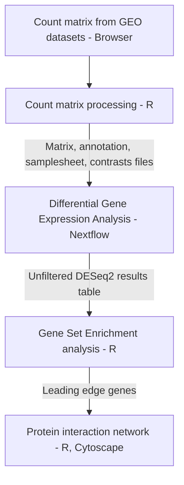

# Transcriptomic analysis of circulating endothelial cells in sickle cell anemia (SCA) stroke

## Introduction
Sickle cell disease (SCD) is a hereditary blood disorder primarily caused by a mutation in the β-globin gene, resulting in abnormal hemoglobin molecules that cause a sickle, crescent shape in red blood cells. Ischemic and hemorrhagic strokes are a crucial cause of death in SCD, with ischemic stroke accounting for approximately 75% of stroke incidences
The aim of this study is to examine the transcriptomic profile of circulating endothelial cells in sickle cell anemia (SCA) stroke and to identify the differentially expressed genes in patients with and without a history of ischemic stroke.
This repository has been set up to document and store all details, steps, and input files required for the execution of this project. 



## Quick-start
```
 nextflow run nf-core/differentialabundance \
     --input <input_dir> \
     --contrasts  <input_dir> \
     --matrix  <input_dir> \
     --outdir  <output_dir> \
     - r \
     -profile 
```

## Parameters 
| Flag   | Requirement | Default Value | Description |
| -------| ----------- | ------------- | ------------ |
```study_name```    | Required | study | A string to identify results in the output directory |
```study_type```    | Required | rnaseq | A string identifying the technology used to produce the data |
```input```       | Required | None | Path to comma-separated file containing information about the samples in the experiment | 
```contrasts```   | Required | None | The output directory where the results will be saved | 
```matrix```     | Required | None | TSV-format abundance matrix |
```outdir```       | Required | None | The output directory where the results will be saved |
```features```     | Optional | None | This parameter allows you to supply your own feature annotations |
```features_id_col``` | Optional | None | Feature ID attribute in the abundance table as well as in the GTF file |
```features_name_col``` | Optional | None | Feature name attribute in the abundance table as well as in the GTF file |
```with-report```       | Optional | None | To generate a comprehensive HTML report of your pipeline execution |
```with-trace ```       | Optional | None | To generate a file containing detailed information for each process |


## Input Files
- Matrix: Tab-Separated Values (.tsv)
- Contrast: Comma-Separated Values (.csv)
- Annotations: Tab-Separated Values (.tsv)
- Samplesheet: Tab-Separated Values (.tsv)

## Installation instructions
### Nextflow
- Create environment
```
conda create --name env_nf nextflow
conda activate env_nf
```
- Install Nextflow
```
conda config --add channels bioconda
conda config --add channels conda-forge
```

## output

