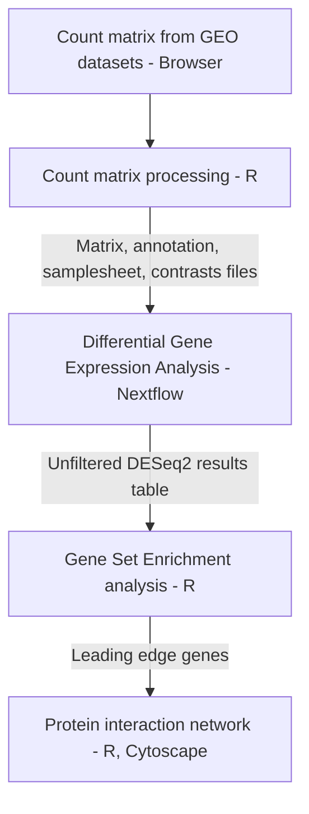

# Transcriptomic analysis of circulating endothelial cells in sickle cell anemia (SCA) stroke

## Introduction
Sickle cell disease (SCD) is a hereditary blood disorder primarily caused by a mutation in the β-globin gene, resulting in abnormal hemoglobin molecules that cause a sickle, crescent shape in red blood cells. Ischemic and hemorrhagic strokes are a crucial cause of death in SCD, with ischemic stroke accounting for approximately 75% of stroke incidences
The aim of this study is to examine the transcriptomic profile of circulating endothelial cells in sickle cell anemia (SCA) stroke and to identify the differentially expressed genes in patients with and without a history of ischemic stroke.
This repository has been set up to document and store all details, steps, and input files required for the execution of this project. 



## Quick-start
```
 nextflow run nf-core/differentialabundance \
     --input  \
     --contrasts  \
     --matrix  \
     --gtf  \
     --outdir  \
     -profile 
```

## Parameters 
| Flag | Requirement | Default Value | Description |
| ---- | ----------- | ------------- | ------------ |


See nfcore

## Input
File type

## Installation instructions
-nextflow

## output

