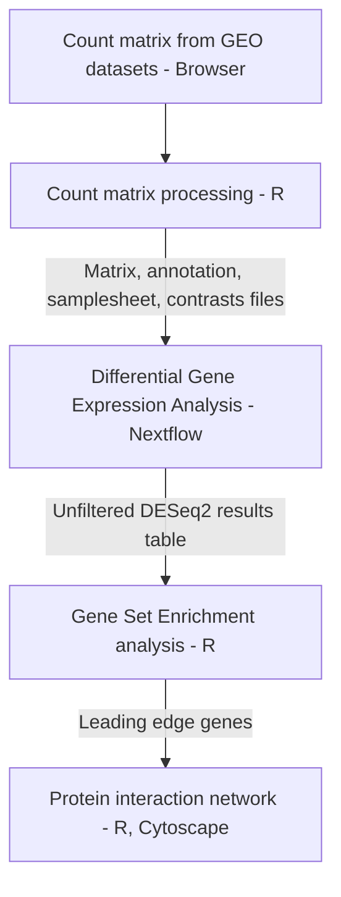

# Transcriptomic analysis of circulating endothelial cells in sickle cell anemia (SCA) stroke

## Introduction
Sickle cell disease (SCD) is a hereditary blood disorder primarily caused by a mutation in the β-globin gene, resulting in abnormal hemoglobin molecules that cause a sickle, crescent shape in red blood cells. Ischemic and hemorrhagic strokes are a crucial cause of death in SCD, with ischemic stroke accounting for approximately 75% of stroke incidences.
The aim of this study is to examine the transcriptomic profile of circulating endothelial cells in sickle cell anemia (SCA) stroke and to identify the differentially expressed genes in patients with and without a history of ischemic stroke.

### Purpose 
This repository has been established to document and store all necessary details, steps, and input files required for the execution of this project. The existence of this repository will enable replication of this project by anyone with access to the required tools. 
The following tools are used in this project: 
- Rstudio (v2024.12.1+563)
- Nextflow (v25.04.3)
- VS Code (v 1.101.0)
- Cytoscape (v3.10.3)
  
The project workflow is as follows:


## Guide to repository
- Environments: Shows the environments present on local computer when running nextflow on the command line.
- Pipeline: Contains input files for the Nextflow pipeline.
- R_scripts: Contains all the R scripts used for the R-based analyses.
- Results: Contains all the results generated from the pipeline run, R, and cytoscape.
- Nextflow_setup: Contains details on how the nextflow pipeline (nf-core/differentialabundance) was run.
- .gitignore: Information on the types of files prevented from uploading.
-  Revision history: Shows the changes that have been made to the repository so far. 
  
## Quick-start
```
 nextflow run nf-core/differentialabundance \
     --input <input_dir> \
     --contrasts  <input_dir> \
     --matrix  <input_dir> \
     --outdir  <output_dir> \
     - r \
     -profile 
```

## Parameters 
| Flag   | Requirement | Default Value | Description |
| -------| ----------- | ------------- | ------------ |
```study_name```    | Required | study | A string to identify results in the output directory |
```study_type```    | Required | rnaseq | A string identifying the technology used to produce the data |
```input```       | Required | None | Path to comma-separated file containing information about the samples in the experiment | 
```contrasts```   | Required | None | The output directory where the results will be saved | 
```matrix```     | Required | None | TSV-format abundance matrix |
```outdir```       | Required | None | The output directory where the results will be saved |
```features```     | Optional | None | This parameter allows you to supply your own feature annotations |
```features_id_col``` | Optional | None | Feature ID attribute in the abundance table as well as in the GTF file |
```features_name_col``` | Optional | None | Feature name attribute in the abundance table as well as in the GTF file |
```with-report```       | Optional | None | To generate a comprehensive HTML report of your pipeline execution |
```with-trace ```       | Optional | None | To generate a file containing detailed information for each process |


## Input Files
- Matrix: Tab-Separated Values (.tsv)
- Contrast: Comma-Separated Values (.csv)
- Annotations: Tab-Separated Values (.tsv)
- Samplesheet: Tab-Separated Values (.tsv)

## Installation instructions
### Nextflow
- Create environment
```
conda create --name env_nf nextflow
conda activate env_nf
```
- Install Nextflow
```
conda config --add channels bioconda
conda config --add channels conda-forge
```
- More options for Nextflow installation can be found on the Nextflow site here: https://nf-co.re/docs/usage/installation
### R and RStudio 
- Instructions for R and Rstudio installation on various operating systems can be found on the R-project website here: https://cran.r-project.org/

### Cytoscape 
- Cytoscape can be downloaded from the Cytoscape organization here: https://cytoscape.org/download.html

## Output
```
results/
├── other/
│   └── deseq2/
│       ├── stroke_vs_control_stroke_in_sickle_cell.dds.rld.rds
│       └── stroke_vs_control_stroke_in_sickle_cell.deseq2.sizefactors.tsv
├── pipeline_info/
│   ├── collated_versions.yml
│   ├── execution_timeline_2025-06-06_18-11-50.html
│   ├── nf_core_differentialabundance_software_versions.yml
│   ├── params_2025-06-06_18-11-55.json
│   └── pipeline_dag_2025-06-06_18-11-50.html
├── plots/
│   ├── differential/
│   │   └── stroke_vs_control_stroke_in_sickle_cell/
│   │       └── png/
│   │           ├── volcano.png
│   │           └── versions.yml
│   ├── exploratory/
│   │   └── condition/
│   │       └── png/
│   │           ├── boxplot.png
│   │           ├── density.png
│   │           ├── mad_correlation.png
│   │           ├── pca2d.png
│   │           ├── pca3d.png
│   │           ├── sample_dendrogram.png
│   │           └── versions.yml
│   └── qc/
├── report/
│   ├── stroke_in_sickle_cell.html
│   └── stroke_in_sickle_cell.zip
├── shinyngs_app/
│   └── stroke_in_sickle_cell/
│       ├── app.R
│       ├── data.rds
│       └── versions.yml
└── tables/
    ├── differential/
    │   ├── stroke_vs_control_stroke_in_sickle_cell.deseq2.results.tsv
    │   └── stroke_vs_control_stroke_in_sickle_cell.deseq2.results_filtered.tsv
    └── processed_abundance/
        └── all.normalised_counts.tsv
```

## Some Key Outputs 
| Output   | Description |
| -------| ----------- | 
stroke_vs_control_stroke_in_sickle_cell.deseq2.results.tsv | Shows the statistics on all genes analyzed |
stroke_vs_control_stroke_in_sickle_cell.deseq2.results_filtered.tsv | Shows the statistics on statistically significant genes |
volcano.png | Volcano plot of genes analyzed |
pca2d.png | PCA plot of all samples |
sample_dendrogram.png | Dendrogram of all samples |
